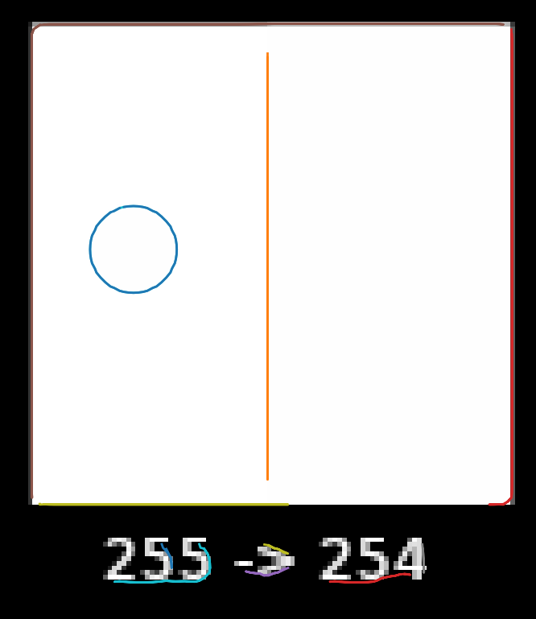
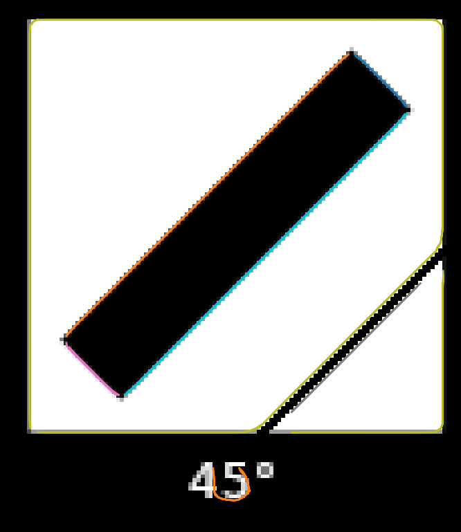

SubtileEdgeDetector
===================

Introduction
------------
SubtileEdgeDetector is a Python library for detecting and extracting subpixel-accurate edges from images. The detectors biggest strength is finding faint and subtile edges that may have one single brightness step change. The library uses Gabor filters and parabolic fitting to achieve high-precision edge detection and provides subpixel coordinates for all detected edges. It is designed to be used in various computer vision tasks, such as feature extraction and camera calibration.

Features
--------
- Faint subpixel-accurate edge-detection using Gabor filters and parabolic fitting
- Configurable Gabor filter parameters, including kernel size and number of orientations
- Configurable non-maximum suppression window size
- Configurable edge-length filter threshold
- Debug mode for visualizing intermediate results

Limitations
-----------

It is important to note that the current Gabor gradient kernels used in the edge detection (step function) may not work well on very thin lines (Dirac-like function w.r.t. the Gabor kernel), where there is a rapid change from background to foreground brightness and back within a distance of the kernel's window size. This limitation can result in less accurate detection or missed edges in images with thin lines or fine structures.

Detecting thin faint lines may be achieved using a tuned kernel instead, though this would not generalize very well.

Setup
-----
To install the SubtileEdgeDetector library, simply clone the repository and install the required dependencies:

First install the prerequisites (assuming a debian based OS here)
```bash
sudo apt-get update
sudo apt-get install python3-venv python3-pip
```

Now clone the repo and enter its root folder
```bash
git clone https://github.com/reish2/SubtileEdgeDetector.git
cd SubtileEdgeDetector
```

Set up a venv and install requirements
```bash
python3 -m venv venv
source venv/bin/activate
pip3 install --upgrade pip
pip3 install --upgrade setuptools
pip3 install -r requirements.txt
echo "Setup done."
echo "Now activate your fresh virtualenv:"
echo "source venv/bin/activate"
```

Activate the venv and run `main.py` to verify that everything worked
```bash
source venv/bin/activate
python3 main.py
```

Usage
-----
To use the SubtileEdgeDetector library, simply import the SubtileEdgeDetector class and create an instance:

```python
import cv2
from subtile_edge_detector import SubtileEdgeDetector

# Create an instance of the SubtileEdgeDetector class
detector = SubtileEdgeDetector()

# Load an input image (in grayscale or color format)
image = cv2.imread("path/to/your/image.png")

# Perform edge detection
detector.compute(image)

# Show results of the computation 
detector.plot_results(image)

# The results can be accessed as follows
detector.edgel_magnitude_subpix 
detector.edgel_mask
detector.edgel_contours_subpix
detector.edgel_theta
```

`detector.edgel_magnitude_subpix`: This numpy array represents the subpixel edge magnitudes in the image. The edge magnitudes indicate the strength of the edges at each pixel location. Higher values indicate stronger edges.

`detector.edgel_mask`: This is a binary numpy array where the value of 1 indicates the presence of a valid edge, and 0 indicates no edge or an invalid edge. This mask is created by applying non-maximum suppression and edge length thresholding to filter out weak or short edges.

`detector.edgel_contours_subpix`: This is a list of numpy arrays, where each array represents a contour (sequence of connected edges) in the image. The coordinates of the contours are subpixel-accurate, making the edge detection more precise than traditional methods that only provide integer pixel coordinates.

`detector.edgel_theta`: This numpy array contains the edge orientation angles (in radians) for each pixel in the image. The angles are estimated using Gabor filters and represent the direction orthogonal to the edge at each pixel location.

Configuration
-------------

You can customize the behavior of the SubtileEdgeDetector by modifying its configuration parameters. To do so, create an instance of the SubtileEdgeDetectorConfig class, modify the parameters as needed, and pass the configuration object to the SubtileEdgeDetector class:

```python
from subtile_edge_detector import SubtileEdgeDetector, SubtileEdgeDetectorConfig

# Create a custom configuration object
config = SubtileEdgeDetectorConfig()
config.gabor_kernel_size = 15
config.non_max_suppression_winsize = 7
config.edge_length_threshold = 20

# Create an instance of the SubtileEdgeDetector class with the custom configuration
detector = SubtileEdgeDetector(config)

# Changing the configuration of the detector instance is simple too
detector.config.edge_length_threshold = 10
detector.apply_config_changes() # make sure to call the apply_config_changes() method
```

Examples
--------

Tesing the results of the `SubtileEdgeDetector` on `data/edge_detector_test.png`


Yields the following result when `detector.plot_results()` is called:


The top-left panel displays the magnitude of the strongest oriented image gradient. 
Applying non-maximum suppression results in the binary edge mask shown in the 
top-right panel. The bottom-left panel presents the sub-pixel accurate contours, 
while the bottom-right panel illustrates the corresponding edgel orientations in 
false colors.

Reviewing the subpixel contours of the lower left pannel, we note the following details:

<table>
  <tr>
    <td width="25%" valign="top">
      
      The brightness changes subtily from 255 to 254. Note how the edge detector finds this subtile change.
    </td>
    <td width="25%" valign="top">
      
      Checking the alignment of the contours around the 45° rotated rectangle, good subpixel alignment is observed.
    </td>
    <td width="25%" valign="top">
      
      Similarly, good subpixel alignment with the 1° rotated rectangle is observed.
    </td>
    <td width="25%" valign="top">
      
      Here, good subpixel alignment with the 0.5° rotated rectangle is observed.
    </td>
  </tr>
</table>

It should be noted that artifacts may be observed in low-texture regions where the
non-maximum suppression detects changes at the periphery of the Gabor kernel window.

Contributing
------------

We welcome contributions to the SubtileEdgeDetector project. If you would like to contribute, please fork the repository and submit a pull request with your changes.

License
-------

This project is licensed under the MIT License. See the LICENSE file for details.